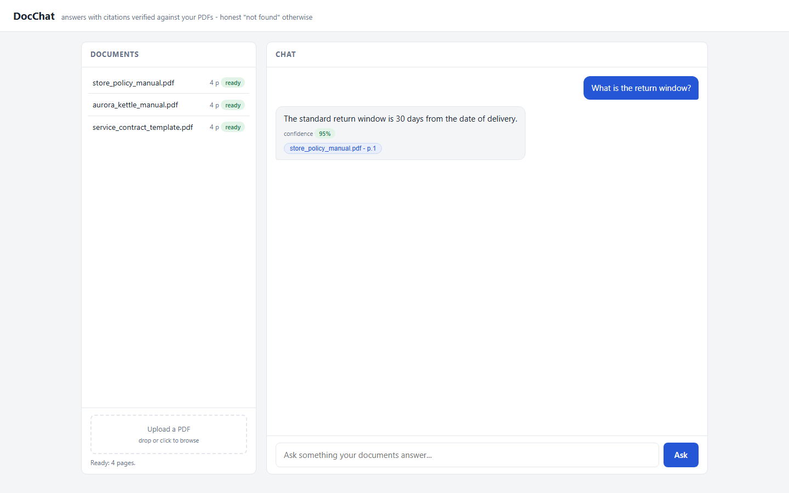
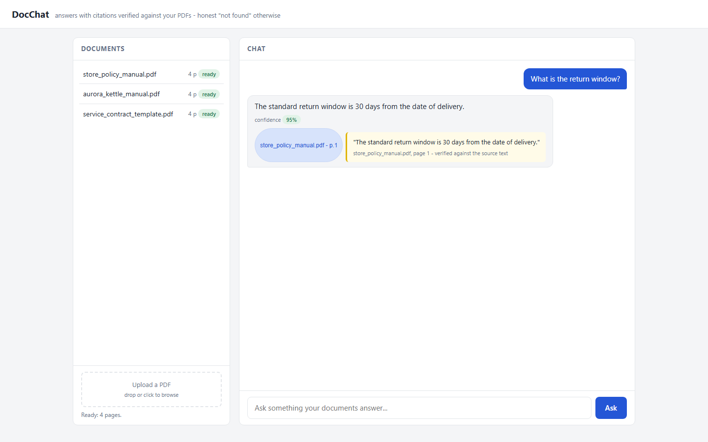
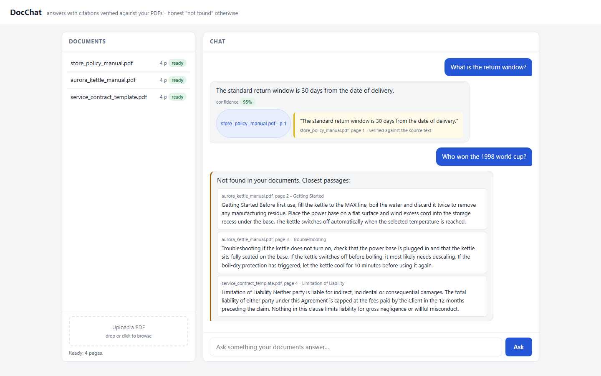
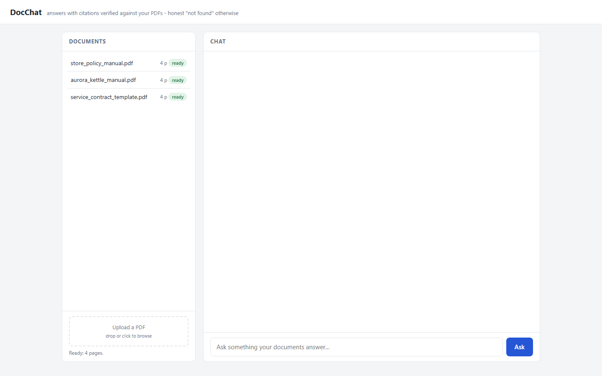
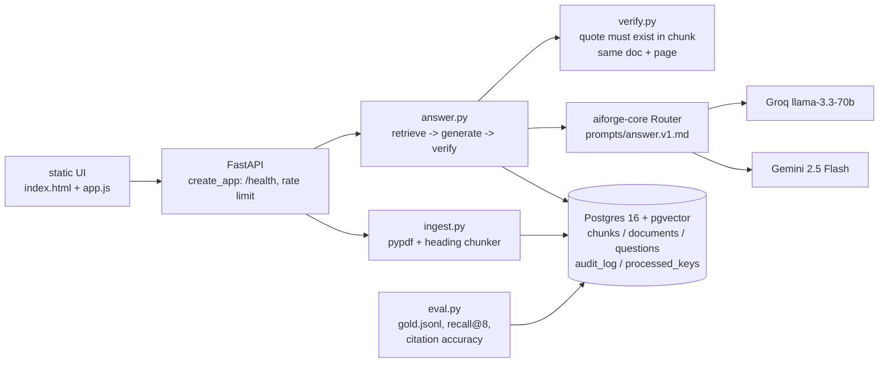

# DocChat: RAG document assistant with verified citations

Upload PDFs, ask questions, get answers with citations that are checked against the
source text before you ever see them - and an honest "not found" when your documents
do not contain the answer.

(60 second Loom video coming soon) | (live demo coming soon)

## 1. Problem

Teams sit on piles of PDFs - policy manuals, product manuals, contracts - and answering
"what does the document actually say?" means scrolling and guessing. Generic chatbots
answer confidently even when the document says nothing, and their "citations" often
point at text that does not exist. A document assistant is only useful if every answer
can be traced to a real passage, and if "we don't know" is a first-class answer.

## 2. What it does

- Upload PDFs; each is extracted per page, split into heading-aware chunks and indexed
  in Postgres (pgvector + full text).
- Ask questions in a chat UI; retrieval is hybrid (vector + keyword, reciprocal-rank
  fusion), generation goes through a Gemini -> Groq fallback router with a strict
  Pydantic schema.
- Every citation is verified deterministically: the quote must appear verbatim
  (whitespace-normalized) in a retrieved chunk from the same doc and page. Bad
  citations are dropped, never shown.
- If nothing verifiable remains, you get "Not found in your documents" plus the three
  closest passages - never an invented answer.
- Built-in eval harness (`make eval`, `GET /eval`) reports retrieval recall@8 and
  citation accuracy over a 20-question gold set.
- Re-uploading the same file is a no-op (idempotency keys), and every pipeline stage
  writes an audit row.

(60 second Loom video coming soon) | (live demo coming soon)

| | |
|---|---|
|  |  |
| *An answer with its confidence badge and a verified citation chip* | *Clicking a chip reveals the exact quoted passage from the source PDF* |
|  |  |
| *An unrelated question gets an honest "not found" plus the closest passages* | *Uploaded PDFs with page count and status; re-uploads never duplicate* |

## 3. Architecture



All model calls go through `aiforge_core.llm.Router.generate_json` with the `Answer`
Pydantic schema; embeddings are local MiniLM (384-dim) or a deterministic stub.

## 4. Guardrails

- **Citation verification**: every quote must appear as a whitespace-normalized
  substring of a retrieved chunk with the same doc and page. Anything else is dropped.
- **Honest not-found**: if the model says `found=false`, or all citations are dropped,
  the status is `not_found` and the UI shows the three closest passages instead of an
  answer.
- **Schema-validated output**: the model must return valid `Answer` JSON; a broken
  response raises `ValidationFailed` and becomes an honest failure, never partial data.
- **Idempotent ingest**: `once(key("ingest", sha256(bytes)))` - re-uploading the same
  PDF creates no duplicate document or chunks.
- **Audit trail**: one `audit_log` row per stage (`ingest`, `retrieve`, `generate`,
  `verify`) with prompt version and input hash.
- **Rate limit**: per-IP sliding window (default 30/min) protects free LLM quotas.

## 5. Limits

- PDFs only, text-based (no OCR for scanned pages, no tables/figures understanding).
- English-tuned retrieval (Postgres `english` text search config, MiniLM embeddings).
- Chunk sizes use a word-count approximation of tokens (words x 1.3), not a real
  tokenizer - documented, deterministic, close enough for ~500-token chunks.
- One answer prompt, no conversation memory: each question stands alone.
- No auth/multi-tenancy: one shared document space per deployment.
- `LLM_PROVIDER_ORDER=mock` (keyless demo) replays canned answers - the first chat
  question gets the sample return-window answer, later ones an honest not-found.

## 6. Run

```bash
make setup    # venv + deps, start postgres (docker), run migrations
make demo     # seed the 3 sample PDFs, serve http://localhost:8000
make eval     # print recall@8 and citation accuracy
```

Copy `.env.example` to `.env` and set `GEMINI_API_KEY` (and optionally `GROQ_API_KEY`).
For a fully offline, keyless demo: `EMBEDDER=stub LLM_PROVIDER_ORDER=mock make demo`
(no model downloads, canned answers). `make demo` with real embeddings needs the
`demo` extra: `uv pip install -p .venv -e ".[demo]"` (pulls sentence-transformers).

### Deploy (Render + Neon)

1. Neon: create a free project, enable the `vector` extension, copy `DATABASE_URL`.
2. Render: new Web Service from this repo, Docker runtime, add the env vars from
   `.env.example`, health check path `/health`.
3. First boot runs migrations and seeds the sample PDFs automatically (idempotent).
4. Confirm `https://<app>.onrender.com/health` returns `{"ok": true}`.
5. Rate limit stays on. Free Gemini quota is enough for demo traffic.

## 7. Tests

`make test` - offline, no keys, MockProvider + StubEmbedder (DB tests use the
throwaway-database fixture from aiforge-core):

- `test_chunking` - a heading lands in the same chunk as its first paragraph, chunk
  overlap is present, no empty chunks.
- `test_citation_verify` - a quote not present in the retrieved text is dropped;
  when every citation is dropped the result is `not_found`.
- `test_not_found` - `found=false` from the model yields `not_found` with exactly 3
  closest passages, a stored question row and audit rows for all stages.
- `test_hybrid_merge` - vector and keyword results sharing a chunk id fuse into one
  entry (reciprocal-rank fusion, deduped).
- `test_ingest_once` - the same bytes uploaded twice create one document and no
  duplicate chunks.
- `test_eval_offline` - the eval harness runs fully offline and prints both metrics.

Eval numbers on the committed gold set (20 questions, StubEmbedder + canned answers,
fully offline):

| metric | value |
|---|---|
| recall@8 | **1.00** |
| citation accuracy | **1.00** |

## 8. Keywords

RAG, retrieval augmented generation, document AI, PDF chatbot, knowledge base
assistant, pgvector, hybrid search, verified citations, hallucination prevention,
LLM evaluation, FastAPI, PostgreSQL.
